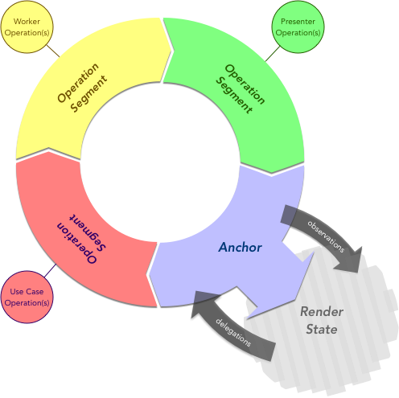
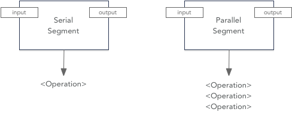

#  QLoop

**QLoop** /'kyoo•loop/ - *n* - Declarative asynchronous operation loops

## Introduction

WIP Enjoy some diagrams while things are still baking...

 

### Loops

This is a "loop":

 

### Segments

These are operation "segments":

